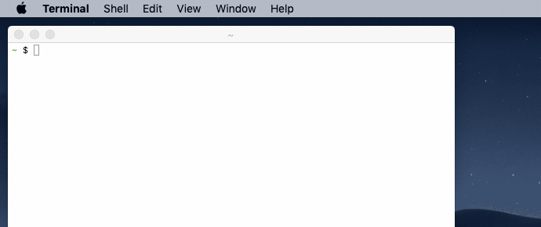
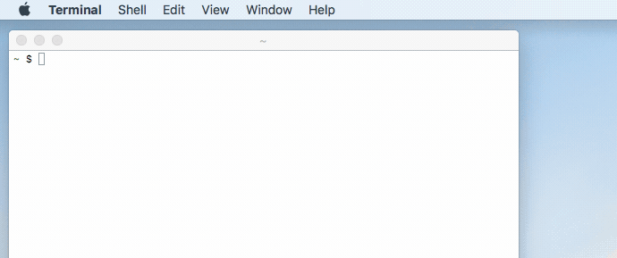

# darkmode

<p align="center">
	<a href="https://github.com/katernet/darkmode/releases/latest"></a>
	
	
</p>

Set macOS dark mode at sunset. If you have Alfred installed, the dark theme will also be set.

This shell script gets the sunrise and sunset times from Night Shift and automates the setting up of two user launch agents for sunrise and sunset, which then take over running the script thereafter. If your mac was asleep/off during the solar times, launchd will run the script when you're next logged in!

Or you can supply your own sunrise and sunset 24H times by passing arguments. Example: 0600 1800

News: macOS Catalina includes an 'Auto' Dark Mode and the current version of Alfred (4.0.3+) remembers the theme selected for the light/dark mode being used when changing the theme preference (switch to the appearance in System preferences, change the Alfred theme accordingly, and repeat for the other one before then returning the system preference to Auto after they've been set.) Basically, there's no point in using this if you're up-to-date 😋. However, if you're on an earlier macOS release or you're a fan of setting your own Dark Mode schedules, then this is just for you!

##### Mojave and later


##### High Sierra and below


### Usage
```
$ ./darkmode.sh

OR

$ ./darkmode.sh HHMM HHMM
```

### Notes

Compatible with macOS Mojave and later Dark Mode. Press OK to the security dialogs to allow control to System Events that appear when first running the script.

Night Shift requires Wifi and "Setting Timezone" enabled in System Preferences > Security & Privacy > Location Services > System Services > Details.

If your Mac does not support Night Shift, please use the previous version [1.7.2](https://github.com/katernet/darkmode/releases/tag/1.7.2) which uses the Yahoo Weather API.

If you have a custom Alfred theme, you can change the name of the themes in the global variables.

A log file is stored in ~/Library/Logs which logs solar time changes and script errors.

To uninstall: ```$ ./darkmode.sh /u```
